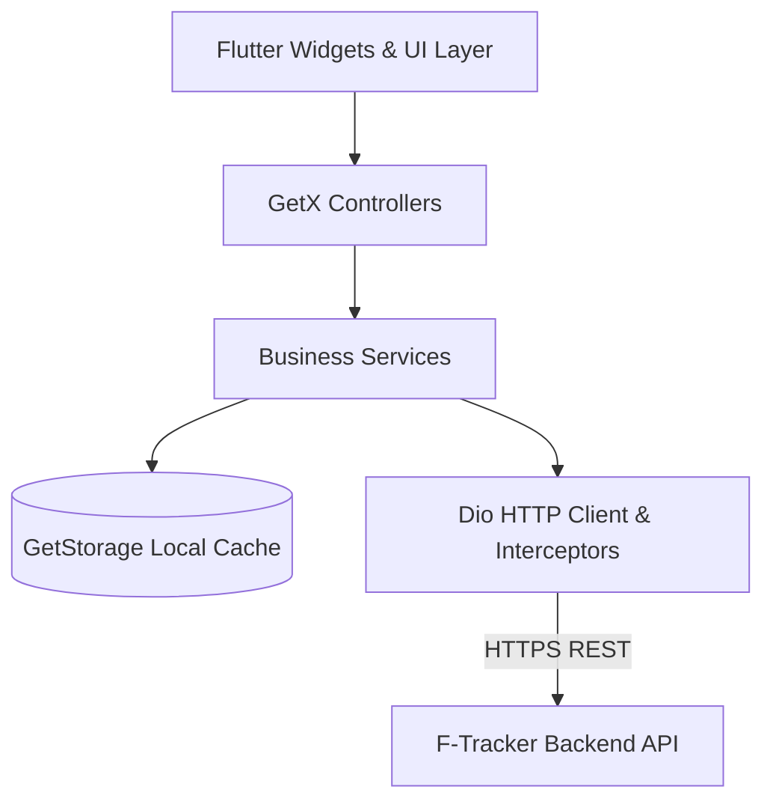

# F-Tracker Mobile

A production-ready cross-platform mobile application for **F-Tracker** built with Flutter and Dart. Designed for seamless financial management, real-time expense and income tracking, category analytics, and automated multi-platform CI/CD deployment.

---

## 📱 Key Capabilities

- **Executive Financial Dashboard**: Real-time balance calculations, recent transactions, and spending distribution.
- **Transaction Management**: Filter, search, and categorize income and expenses with date-range pickers and receipt attachments.
- **Visual Analytics**: Interactive expense distribution breakdowns and cashflow charts powered by `fl_chart`.
- **Category Customization**: Manage transaction categories with custom icons, color palettes, and budget limits.
- **Glassmorphic Floating Navigation**: Modern floating navigation bar with quick transaction actions and smooth transition animations.
- **Secure Authentication & Token Refresh**: Built-in OAuth2 / Google Sign-In and JWT session management via reactive interceptors.
- **Automated CI/CD Workflows**: Android Play Store (Internal Track) & Apple TestFlight automated pipelines.

---

## 🏗️ Architecture Overview

The application follows modular Clean Architecture powered by **GetX** for reactive state management, dependency injection, and route handling.



### Module Structure

```text
lib/
├── core/
│   ├── constants/       # App-wide colors, strings, and assets
│   ├── network/         # Dio client, API interceptors, error handling
│   ├── services/        # Storage, auth, connectivity services
│   ├── theme/           # Design tokens, typography, dark/light themes
│   ├── utils/           # Formatters, validators, date helpers
│   └── widgets/         # Shared reusable UI components
├── modules/
│   ├── analytics/       # Cashflow charts & expense statistics
│   ├── auth/            # Login, registration, OAuth
│   ├── categories/      # Category management & budgets
│   ├── dashboard/       # Overview dashboard & balance cards
│   ├── navigation/      # Floating glassmorphic bottom bar
│   ├── settings/        # User profile, preferences, logout
│   ├── splash/          # App initialization & session guard
│   └── transactions/    # CRUD transaction forms & logs
├── routes/              # App routing, bindings, and middlewares
└── main.dart            # Application entrypoint
```

---

## 🛠️ Tech Stack

| Category | Technology |
|---|---|
| **Framework** | [Flutter 3.x](https://flutter.dev/) (Channel `stable`) |
| **Language** | [Dart](https://dart.dev/) |
| **State Management** | [GetX](https://pub.dev/packages/get) |
| **HTTP Client** | [Dio](https://pub.dev/packages/dio) |
| **Local Storage** | [GetStorage](https://pub.dev/packages/get_storage) |
| **Data Visualization** | [FL Chart](https://pub.dev/packages/fl_chart) |
| **Typography** | [Google Fonts](https://pub.dev/packages/google_fonts) |
| **CI/CD** | GitHub Actions (`exa31/github-workflows`) |

---

## 🚀 Quickstart & Local Setup

### Prerequisites

- [Flutter SDK](https://docs.flutter.dev/get-started/install) (`^3.13.3` or later)
- [Dart SDK](https://dart.dev/get-dart)
- Android Studio / Android SDK (for Android builds)
- Xcode & CocoaPods (for iOS macOS development)

### Setup Steps

1. **Clone the repository:**
   ```bash
   git clone git@github.com:exa-dev-ftracker/f-tracker-flutter.git
   cd f-tracker-flutter
   ```

2. **Configure Environment Variables:**
   ```bash
   cp .env.example .env
   ```

3. **Install Dependencies:**
   ```bash
   flutter pub get
   ```

4. **Install iOS Pods (macOS only):**
   ```bash
   cd ios && pod install && cd ..
   ```

5. **Run Development Server:**
   ```bash
   flutter run
   ```

---

## ⚙️ Environment Variables

Configure `.env` with the following keys:

| Variable | Description | Required | Default |
|---|---|---|---|
| `API_BASE_URL` | Base URL for F-Tracker Backend API | Yes | `https://be-ftracker.eka-dev.cloud` |
| `APP_NAME` | Display application title | No | `F-Tracker` |
| `GOOGLE_SERVER_CLIENT_ID` | Google OAuth Web / Server Client ID | Yes | Synthetic / Sandbox Client ID |
| `GOOGLE_IOS_CLIENT_ID` | Google OAuth iOS Client ID | Yes | Synthetic / Sandbox Client ID |

---

## 📦 CI/CD & Distribution

The repository uses reusable GitHub Actions workflows configured in `.github/workflows/`:

- **Android Pipeline** (`deploy-android.yml`):
  - Builds optimized AAB (Android App Bundle) and APK.
  - Automatically signs with production keystore.
  - Deploys directly to Google Play Console (Internal Track).
- **iOS Pipeline** (`deploy-ios.yml`):
  - Builds signed IPA using Apple Distribution certificate and provisioning profiles.
  - Deploys to Apple TestFlight via App Store Connect API.
- **Automated Versioning** (`release.yml`):
  - Employs Semantic Release to generate changelogs and GitHub releases.
